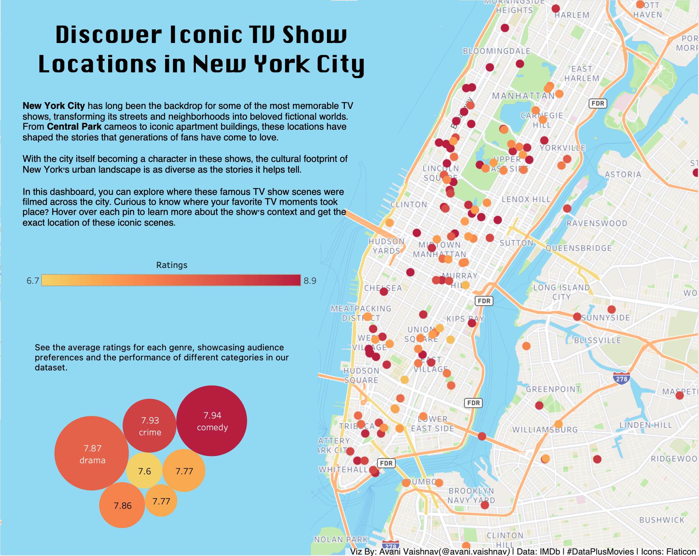

# Exploring Iconic TV Show Locations in New York City

This Tableau project visualizes the filming locations of iconic TV shows set in New York City. Through an interactive dashboard, users can explore various locations, the context of each place within the show, and detailed information about how these locations contribute to the overall storyline and cultural identity of New York.



## Dashboard Overview

### Features:
- **Interactive Map**: Explore the exact locations where iconic scenes were filmed in New York City.
- **Location Descriptions**: Each pin on the map is accompanied by detailed context, including character interactions and pivotal scenes.
- **Dynamic Tooltips**: Hover over each pin to see contextual information about the show's scene, as well as a clickable link to the source of the information.
- **Rating Color Scheme**: Locations are visually grouped by the show's IMDb rating, with a continuous color scale for intuitive understanding.

### Goals:
- To illustrate how New York City has become an integral part of the cultural identity of popular TV shows.
- To give users an interactive experience, allowing them to connect famous shows with their real-life locations.
- To celebrate the diversity of storytelling that unfolds within NYC's iconic neighborhoods.

## Installation and Usage

1. **Tableau Public**: This project is published on Tableau Public. You can access it directly [here](https://public.tableau.com/app/profile/avani.vaishnav/viz/NY_Shows/Dashboard1).
2. **GitHub Repository**: This repository contains the supplementary files, data sources, and additional documentation used to create the project.

### How to View the Dashboard Locally
If you wish to view or modify the dashboard in Tableau Desktop:
1. Clone this repository to your local machine using:
   ```bash
   git clone https://github.com/your-username/nyc-tv-show-locations.git
